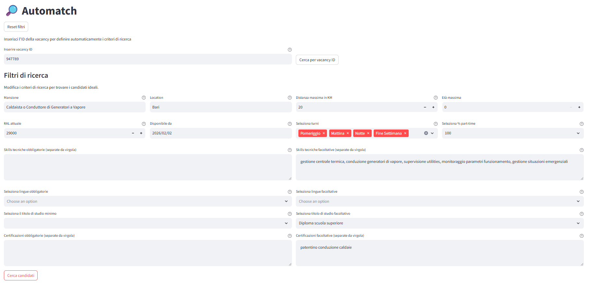
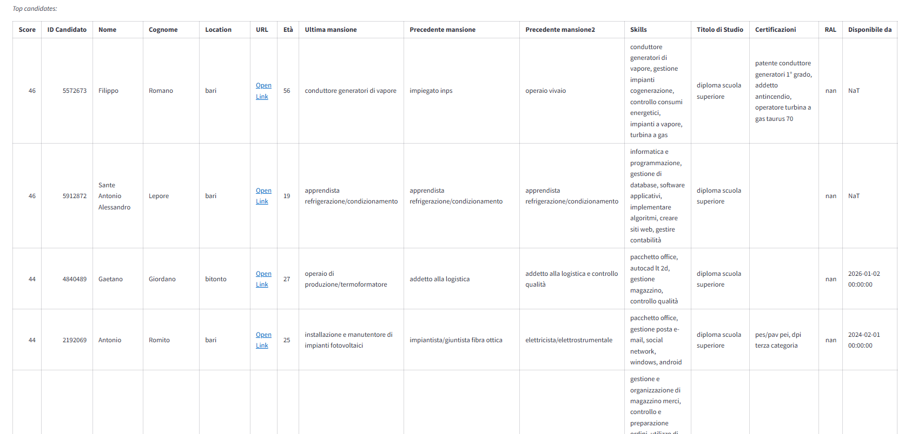

# 🧠 Candidates-to-Jobs Auto-Match with Snowflake Cortex AI

This project builds an automated pipeline that extracts information from candidates' CVs and job descriptions using Snowflake Cortex AI.  
It also implements an automatching engine that matches candidates to relevant job postings. The solution combines natural language search, structured filtering, and Snowpark to deliver intelligent and scalable matching for recruiting and talent platforms.

## 🚀 Features

- **NER extraction pipeline**: An automated pipeline that extracts relevant information from CVs and job descriptions.  
    - ***Data Ingestion Stage***: Ingests new candidates and vacancies into the pipeline.  
    - ***Data Transformation Stage***: Performs Named Entity Recognition to extract key information from candidates (e.g., job experience, skills, certifications) and from vacancies (e.g., job position, location, required skills).  
    - ***Deployment***: Deploys the pipeline into Snowflake.  

- **Streamlit app for automatch**: The Streamlit app allows recruiters, with a single click, to match a vacancy with all candidates and obtain a ranked list based on their fit.  
    - ***Streamlit UI***: Provides an interactive front-end for entering queries, selecting filters, and viewing ranked results.  
    - ***Structured Filtering***: Supports hard filters such as location, age, availability, and salary.  
    - ***Automatch Service***: Matches candidates to jobs based on CV content and job descriptions.  
    - ***Snowpark Integration***: Executes SQL and Python logic inside Snowflake for efficient data processing.


## 🛠️ Setup Instructions

1. **Clone the repository**

```bash
git clone https://github.com/AntonioMariaFiscarelli/Candidates-to-Jobs-Auto-Match-Cortex-AI
cd Candidates-to-Jobs-Auto-Match-Cortex-AI
```

2. **Install dependencies**

```bash
pip install -r requirements.txt
```

3. **Configure environment**
Create a .env file with your Snowflake credentials and warehouse name:
SNOWFLAKE_WAREHOUSE=your_warehouse_name

4. **Deploy and start the pipeline into Snowflake**
```bash
python main.py
```

5. **Run the Streamlit app**
```bash
streamlit run app.py
```

## 📂 Project Structure
```bash
project/
├── config/
│   └── config_dev.yaml
│   └── config_test.yaml
│   └── schema.yaml
│   └── params.yaml
├── notebooks/
├── src/
│   └── autoMatch/
│   │   ├── components/
│   │   │   └── data_ingestion.py
│   │   │   └── data_transformation.py   
│   │   │   └── automatch.py      
│   │   │   └── init.py
│   │   ├── config/
│   │   │   └── configuration.py
│   │   │   └── init.py
│   │   ├── constants/
│   │   │   └── init.py
│   │   ├── deployment/
│   │   │   └── deployment.py
│   │   │   └── init.py
│   │   ├── entity/
│   │   │   └──config_entity.py
│   │   │   └── init.py
│   │   ├── pipeline/
│   │   │   └── stage_01_data_ingestion.py
│   │   │   └── stage_02_data_transformation.py
│   │   │   └── stage_03_automatch.py
│   │   │   └── init.py
│   │   ├── utils/
│   │   │   ├── box/
│   │   │   └── common.py
│   │   │   └── snowfkale_utils.py
│   │   │   └── init.py
│   │   └── init.py
│   └── init.py
└── requirements.txt
└── .env
└── snowflake.session-parameters.json
└── snowflake.yaml
└── environment.yaml
└── template.py
└── main.py
└── app.py
└── README.md
```

## 📊 Example Use Case



## 📄 License
This project is licensed under the MIT License.
